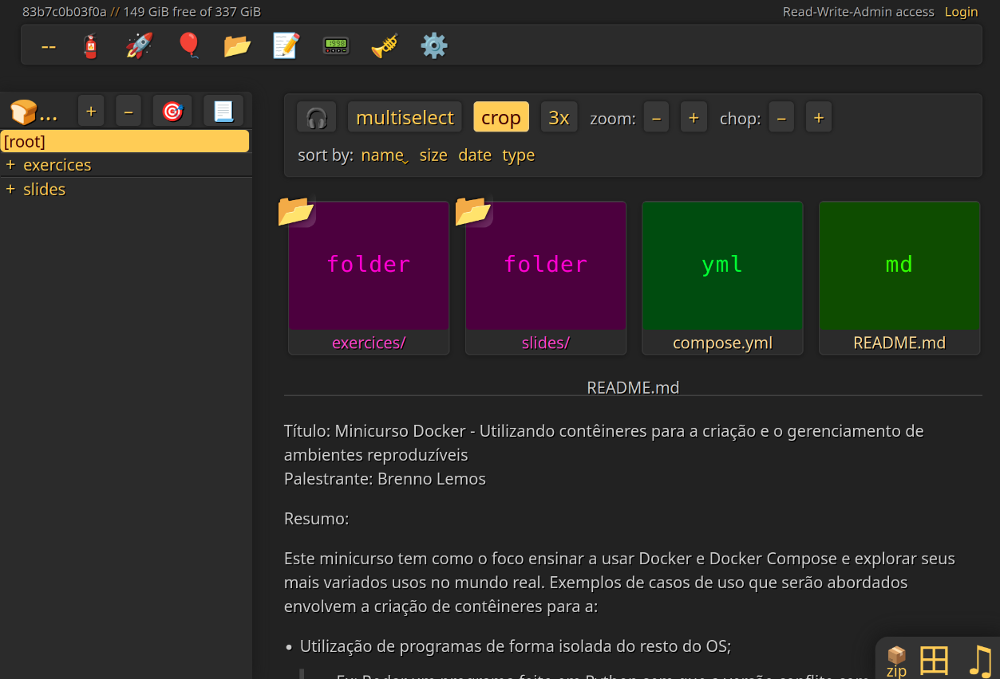
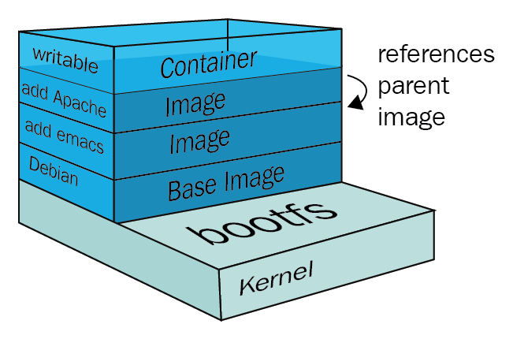
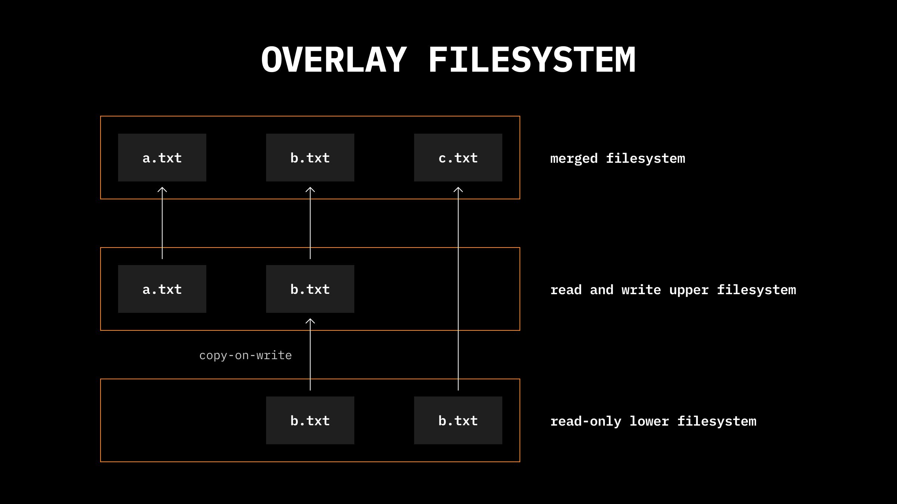
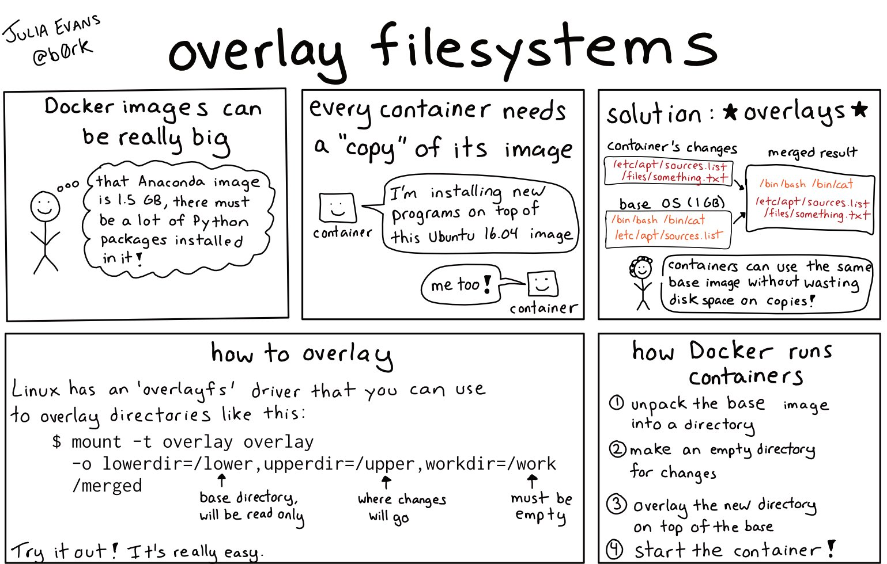

<!-- _header: '' -->
<!-- _footer: '' -->
<!-- _paginate: false -->

# Docker - Usando contêineres para criar ambientes reproduzíveis
## SECOMP 2025
### Brenno Lemos

-  [Syndelis](https://github.com/Syndelis)
-  [@brenno@fosstodon.org](https://fosstodon.org/@brenno)


---

### 0. Sobre mim

<div class="unequal-columns">

<div class="column-23-start">

Sou Mestre em Ciência da Computação pela UFSJ.

Trabalho como Engenheiro de Software há 5 anos.

Mais recentemente, trabalho como Engenheiro de Software Sênior Rust para a Arionkoder.

Na SECOMP 2022, participei como palestrante e apresentei a linguagem Rust.

Na [SECOMP 2023](https://secomp2023.brenno.codes), ofertei um minicurso de Rust com o foco de ensinar todo o básico até funcionalidades avançadas.

</div>

<div class="column-13-end">


</div>

</div>

--- 

# Antes de começarmos

## Cheque se sua máquina está com Docker instalado e com as permissões corretas

```sh
$ docker run --rm hello-world
```


---

<div class="centered">

# Aprenda a usar Docker!

</div>

<div class="three-columns">

<div class="centered">

[secomp2025.brenno.codes](https://secomp2025.brenno.codes)


</div>

<div class="centered">

[Repositório dos slides](https://github.com/Syndelis/minicurso-docker-secomp-2025)


</div>

<div class="centered">

[Documentação Docker](https://docs.docker.com/)


</div>


</div>


---

<!-- Perguntar se os alunos estão familiares com o conceito de máquinas virtuais -->
<!-- Senão, fazer um paralelo com emuladores (com a diferença de emular hardware+software vs emular primariamente software) -->

<!-- _class: title lead invert -->
<!-- _header: '' -->

# 1. O que é Docker?

Docker é uma coleção de ferramentas de virtualização. Pode ser comparado com máquinas virtuais, porém possui uma abordagem programática.

Isto quer dizer que o Docker é ideal para a criação de ambientes reproduzíveis, isto é, ambientes que possam ser criados uma vez e executados inúmeras vezes em diferentes máquinas, sempre gerando o mesmo resultado.


---

# 1.1. Pra que serve o Docker?

Docker possui inúmeras aplicações. Aqui estão algumas que abordaremos neste minicurso:

- Rodar programas sem a necessidade de instalá-los na máquina;
- Compilar programas para outros sistemas operacionais;
- Executar serviços como webservers e bancos de dados;
- Rodar _pipelines_ em ambientes externos como [GitHub Actions](https://docs.github.com/en/actions);

---

<!-- _class: title small lead invert -->
<!-- _header: '' -->
<!-- _footer: 'Todos os comandos usados durante este minicurso estão disponíveis no [repositório](https://github.com/Syndelis/minicurso-docker-secomp-2025)' -->

# 2. Rodando programas sem instalá-los

Neste exemplo, executaremos a aplicação [Copyparty](https://github.com/9001/copyparty/) usando Docker, sem a necessidade de instalar o programa ou suas dependências no computador.

<div class="columns">

<div>

```sh
docker run --rm -it \
 -u 1000 -p 3923:3923 \
 -v .:/w copyparty/min -v .::rw:a
```

Rode este comando e acesse o serviço pelo navegador:

http://localhost:3923

</div>


<div>



</div>

</div>

---

<!-- _header: '' -->
<!-- _class: attention title tiny lead invert -->

# 2.1. Intermissão: A anatomia de um comando Docker

<div class="unequal-columns">

<div class="column-13-start fixed-list">

- docker run
- --rm
- -it
- -u 1000
- -p 3923:3923
- -v .:/w
- copyparty/min
- -v .::rw:a

</div>

<div class="column-23-end list-right fixed-list">

- Comando e subcomando. "Execute algo"
- **R**e**m**ova o contêiner após ele terminar de executar
- **-i**= interativo; **-t** = TTY, ou "terminal"
- Executar como usuário 1000 (o padrão)
- Exponha a porta 3923
- Compartilhe a pasta local com o contêiner em **/w**
- Nome da imagem (em https://hub.docker.com/)
- Este é um argumento para o programa executado no contêiner. Não tem relação com o **-v** anterior

</div>

</div>

---

# 2.2. Usando qualquer versão de Python

Muitos programas e ferramentas famosas estão disponíveis em formato de imagens no [Docker Hub](https://hub.docker.com).

Por exemplo, é possível usar a versão mais recente de Python para rodar um script:

```sh
docker run --rm -v ./:/tmp python:3.13 python3 /tmp/hello_world.py
```

Isto pode ser útil quando a versão desejada do interpretador não estiver disponível na máquina. Por exemplo, Ubuntu 22.04 e derivados possuem Python 3.10 instalado, mas a versão 3.13 já foi lançada.

<!-- De forma similar, estes slides são "compilados" em HTML por meio de ferramenta de JavaScript que eu propositalmente não instalei no meu computador. Ao invés, eu usei um contêiner com a ferramenta pré-instalada. -->

<!-- Exercitar a execução de contêiner Python interativo para facilitar a transição para o próximo slide -->

---

### 2.2.1. E as dependências?

Poderíamos escrever um _shell script_ para instalar uma biblioteca e depois executar o nosso script.

<div class="columns">

<div>

`mult_array.sh`
```sh
#!/usr/bin/env bash
pip3 install numpy
python3 mult_array.py
```

</div>


<div>

`mult_array.py`
```py
import numpy as np
x = np.array([1, 2, 3, 4])
print(x * 3)
```

</div>
</div>

```sh
docker run --rm -v ./:/tmp -w /tmp python:3.13 bash mult_array.sh
```

Contudo, há um problema: sempre que executamos o contêiner, a dependência tem que ser baixada novamente. Veremos no próximo capítulo como podemos construir novas imagens de Docker para evitar isso.

<!-- Explicar que, se não usássemos o '--rm', a dependência estaria pelo menos cacheada da próxima execução, mas ainda seria realizada a tentativa de instalá-la novamente -->

---

<!-- _class: title small lead invert-->
<!-- _header: '' -->

# 3. Compilando programas para outro 'OS'

É possível usar o Docker para compilar programas para outros sistemas operacionais. Por exemplo, seria possível rodar Docker no Windows ou MacOS (_internamente gerenciado por VMs_) e compilar programas para Linux.

No próximo exemplo, escreveremos uma nova imagem de Docker que compila um programa em C e o executa.

---

<!-- _footer: '`main.c` pode ser encontrada no [repositório](https://github.com/Syndelis/minicurso-docker-secomp-2025/blob/main/exercises/chap-3/main.c), em `exercises/chap-3/main.c`' -->

# 3.1. Criando sua primeira imagem

<div class="columns">

<div>

```docker
FROM debian
RUN apt-get update && apt-get install -y gcc
COPY main.c main.c
RUN gcc main.c -o main
ENTRYPOINT ["./main"]
```

</div>

<div>

```
<-- Camada base
<-- Instale GCC
<-- Copie o programa local para o contêiner
<-- Compile o programa
<-- Rode o programa
```

</div>

</div>

```sh
$ docker build . -t minha_imagem -f Dockerfile

$ docker run --rm minha_imagem
```

<!-- Mostrar o alpine como alternativa ao debian. Mostrar que não é possível rodar um programa compilado pra uma máquina mais nova em uma mais velha (user trixie-slim vs stretch-slim) -->

---

<!-- _header: '' -->
<!-- _footer: 'As explicações neste slide estão dramaticamente simplificadas para efeitos didáticos. ' -->
<!-- _class: attention title small lead invert -->

# 3.2. Intermissão: O que é uma imagem de Docker?

De forma simplificada, todo comando executado com Docker está dentro de um contêiner. Todo contêiner é baseado em uma imagem, e toda imagem possui múltiplas camadas. _Nada se cria, tudo se copia_.

<div class="columns">

<div>

Cada camada pode modificar o sistema de arquivos. Por exemplo, se a camada base for uma distribuição Linux como o [Debian](https://www.debian.org/), uma possível próxima camada poderia instalar um programa, como [Emacs](https://www.gnu.org/software/emacs/), GCC, ou Python.

</div>

<div>



</div>
</div>

---

<!-- _footer: '¹ Overlay FS é uma das maneiras com a qual o Docker pode escolher gerenciar as camadas, mas todas as outras opções funcionam de maneiras similares para o propósito desta explicação.' -->

## 3.2.1. Overlay FS

<div class="columns">

<div>

A modificação de arquivos por camada ocorre de uma maneira que evite o desperdício de armazenamento da máquina. Quando um arquivo é modificado dentro de um contêiner em execução, por exemplo, esta modificação ocorre apenas na camada do contêiner, que é sobreposta sobre as camadas anteriores. Isto é gerenciado por um sistema do Linux conhecido como OverlayFS¹. 

</div>

<div>



</div>

</div>

---

<!-- _header: '' -->
<!-- _footer: '' -->



---

<!-- _footer: '`mult_array.py` pode ser encontrada no [repositório](https://github.com/Syndelis/minicurso-docker-secomp-2025/blob/main/exercises/chap-2/mult_array.py), em `exercises/chap-2/mult_array.py`' -->

## 3.3. Reparação histórica: criando nossa imagem de Python

```docker
FROM python:3.13-alpine
RUN pip install numpy
WORKDIR /app
COPY mult_array.py .
ENTRYPOINT ["python3", "mult_array.py"]
```

```sh
$ docker build . -t python_mult_array -f Dockerfile

$ docker run --rm python_mult_array
```

Nesta imagem, o [NumPy](https://numpy.org/) será instalado durante o comando `docker build`. Portanto, não será necessário reinstalá-lo cada vez que executarmos a imagem com `docker run`

---

<!-- _header: '' -->
<!-- _class: lead invert title tiny figure-background -->

# 4. Executando serviços com Docker

Nas seções anteriores, foi demonstrado como o Docker pode ser usado pra criar um ambiente reproduzível, seja para executar um programa que finaliza após algum tempo (como em **3.1.**) ou para agir como um servidor, que executa até que o usuário o termine (como em **2.**).

Nesta seção, veremos como podemos organizar diferentes serviços para trabalhar em conjunto com uma ferramenta conhecida como [Docker Compose](https://docs.docker.com/compose/).

Este processo é conhecido como "orquestração".


---

<!-- footer: 'Apenas trecho do código. Todos os códigos apresentados nestes slides estão disponíveis no [repositório](https://github.com/Syndelis/minicurso-docker-secomp-2025)' -->

#### 4.1. Caso de uso: execução de um servidor web com banco de dados

<div class="small">

Considere o seguinte serviço escrito em [Python](https://python.org) com [FastAPI](https://fastapi.tiangolo.com/) e [SQLModel](https://sqlmodel.tiangolo.com/):

</div>

```py
class User(SQLModel, table=True):
    id: int | None = Field(default=None, primary_key=True)
    name: str
    age: int

engine = db_connect()
def get_db():
    with Session(engine) as session:
        yield session

Db = Annotated[Session, Depends(get_db)]
api = FastAPI()

@api.get("/user")
def list_users(db: Db):
    return db.exec(select(User)).all()
```

---

<div class="unequal-columns">

<div class="column-23-start">

`compose.yml`

```yaml
services:
  db:
    image: postgres:17
    environment:
      POSTGRES_USER: user
      POSTGRES_PASSWORD: password
      POSTGRES_DB: app
    ports:
      - 5432:5432

  app:
    build: .
    environment:
      DATABASE_URL: |
        postgresql+psycopg2://user:password@db:5432/app
    ports:
      - 8000:8000
```

</div>

<div class="column-13-end">

`Dockerfile`

```docker
FROM python:3.13-alpine

COPY requirements.txt .
RUN pip install -r requirements.txt

COPY server.py .
ENTRYPOINT [
  "fastapi",
  "dev",
  "--host",
  "0.0.0.0",
  "server.py"
]
```

</div>

</div>

---

<!-- footer: 'Minicurso Docker' -->
<!-- _header: '' -->
<!-- _class: lead invert title small -->

# 5. Usando Docker para automações

Alguns _hosts_ de repositórios Git como o [GitHub](https://github.com) e o [Forgejo](https://forgejo.org) suportam a execução de scripts diretamente em seus servidores dado algum evento, como o `push` de um novo _commit_ ou a criação de uma nova _release_.

Estes scripts podem servir múltiplos propósitos e são escritos em _shell script_.

Podemos nos aproveitar destas _pipelines_ para criar um fluxo de lançamento contínuo (_CD_; em inglês _Continuous Deployment_). Ao invés de escrever _scripts_ complexos de **bash** que comumente não são trivialmente testáveis localmente, podemos usar o Docker, que, novamente, nos provê ambientes reproduzíveis.


---

## 5.1. Escrevendo workflows para o GitHub

<div class="columns">

<div>

No GitHub, arquivos em `.github/workflows/` definem fluxos que podem ser executados em diferentes circunstâncias, a depender da tag `on` do arquivo. 

No exemplo ao lado, vemos um fluxo que emitirá nos logs de execução uma mensagem "Hello, World!"

</div>

<div>

`.github/workflows/hello_world.yml`

```yaml
name: Hello World
on:
  push:
    branches:
      - main
jobs:
  build:
    runs-on: ubuntu-latest
    steps:
      - name: Say hello world
        shell: bash
        run: echo Hello, World!
```

</div>

</div>

---

<!-- _footer: '' -->

###### 5.2. Workflows para a compilação de código

```yaml
name: Compile and Run
on:
  push:
    branches:
      - main
jobs:
  build:
    runs-on: ubuntu-latest
    steps:
      # roda uma ação pré-definida encontrada em
      # https://github.com/actions/checkout
      - name: Checkout Repository
        uses: actions/checkout@v4
      - name: Compile code
        shell: bash
        run: gcc main.c -o main
      - name: Run it
        shell: bash
        run: ./main
```

---

<!-- _class: lead invert title tiny attention -->

# 5.3. Recursão? Publicando slides com um workflow

<div class="columns">

<div>

```yaml
- name: Markdown to HTML
  uses: docker://ghcr.io/marp-team/marp-cli:v4.2.3
  env:
    MARP_USER: root:root
  with:
    args: slides/main.md-o build/index.html --html

- name: Deploy production
  uses: JamesIves/github-pages-deploy-action@v4
  with:
    branch: gh-pages
    folder: ./build/
```

</div>


<div>

Este trecho faz parte da definição do workflow neste repositório que realiza a publicação dos slides em https://secomp2025.brenno.codes/

</div>

</div>

O fluxo utiliza a mesma imagem de Docker que foi usada localmente durante a escrita dos slides, garantindo que a mesma ferramenta, na mesma versão e com as mesmas dependências, está sendo usada. Assim, os resultados são idênticos.

---

### 5.4. Extra: publicando suas próprias imagens

<div class="columns">

<div>

Imagens de Docker devem ser publicadas em repositórios de imagens. Exemplos destes repositórios são: [Docker Hub](https://hub.docker.com/), [GHCR](https://ghcr.io) (_GitHub Container Registry_), e [AWS ECR](https://aws.amazon.com/ecs/) (_Elastic Container Registry_).

</div>

<div>

```yaml
- name: Log in to the Container registry
  uses: docker/login-action@v2
  with:
    registry: ghcr.io
    username: ${{ github.actor }}
    password: ${{ secrets.GITHUB_TOKEN }}

- name: Define Image Tag
  id: image-tag
  shell: bash
  env:
    USER_AND_REPO: ${{ github.repository }}
  run: echo "tag=ghcr.io/${USER_AND_REPO,,}:latest" >> "$GITHUB_OUTPUT"

- name: Build and Publish Image
  uses: docker/build-push-action@v5
  with:
    push: true
    tags: ${{ steps.image-tag.outputs.tag }}
```

</div>

</div>

Cada um possuirá diferentes métodos para a autenticação, mas a ação de publicar uma imagem em qualquer caso está relacionada ao comando `docker push`. 

O exemplo deste slide contém um trecho que poderia ser utilizado para publicar uma nova imagem no GHCR.

---

<!-- header: '' -->
<!-- footer: '' -->
<!-- paginate: false -->
<!-- class: end -->

# Créditos

<div class="columns">

<div>

**Brenno Lemos** - Escrita do material

-  [/Syndelis](https://github.com/Syndelis)
-  [/in/brenno-dev](https://linkeding.com/in/brenno-dev)

</div>

<div>

**José Luis da Cruz Junior** - Validação do material, sugestões e correções técnicas e ortográficas

-  [/zejuniortdr](https://github.com/zejuniortdr)
-  [/in/jose-luis-da-cruz-junior](https://www.linkedin.com/in/jose-luis-da-cruz-junior)

</div>

</div>

---

# Desbravando Rust

<!-- Um livro próximo de ser lançado escrito pelo José Luis da Cruz Junior -->
É um livro em português próximo de ser lançado. O livro tem como o objetivo de ser o material definitivo para quem tem interesse de se profissionalizar na linguagem, cobrindo desde o mais simples _Hello World_ até aplicações complexas no mundo real, como a criação de APIs e _Lambdas_ da AWS.

Siga o autor para atualizações sobre seu lançamento:  [/in/jose-luis-da-cruz-junior](https://www.linkedin.com/in/jose-luis-da-cruz-junior)


